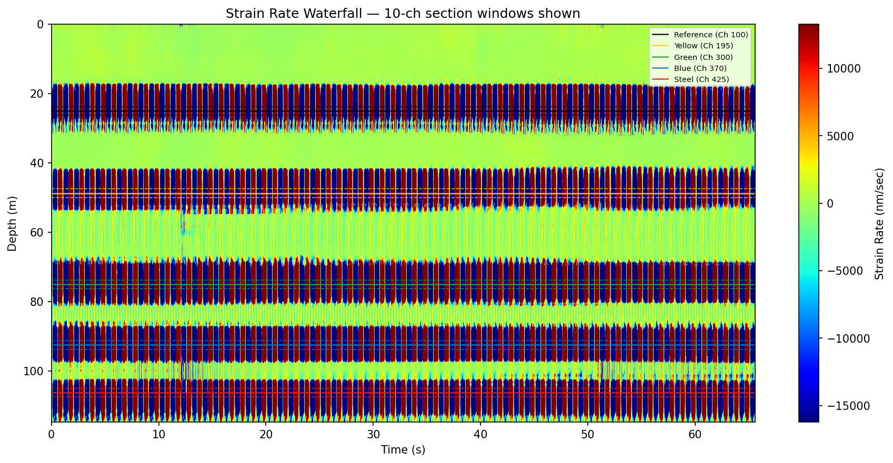
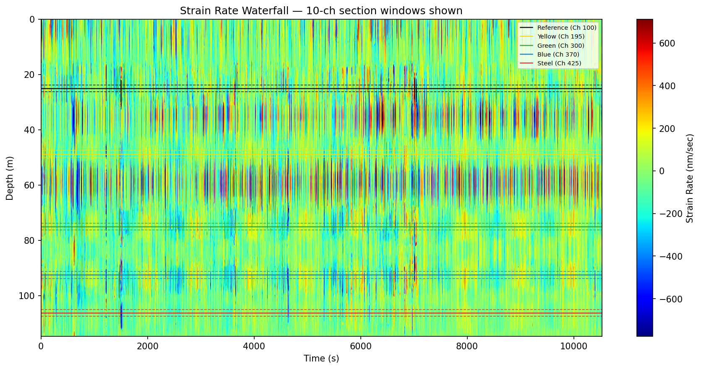
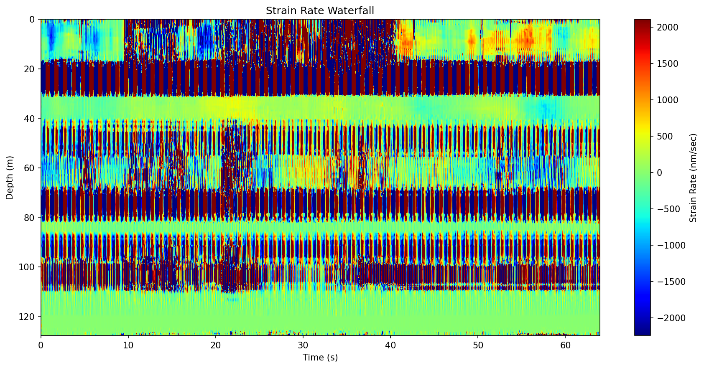
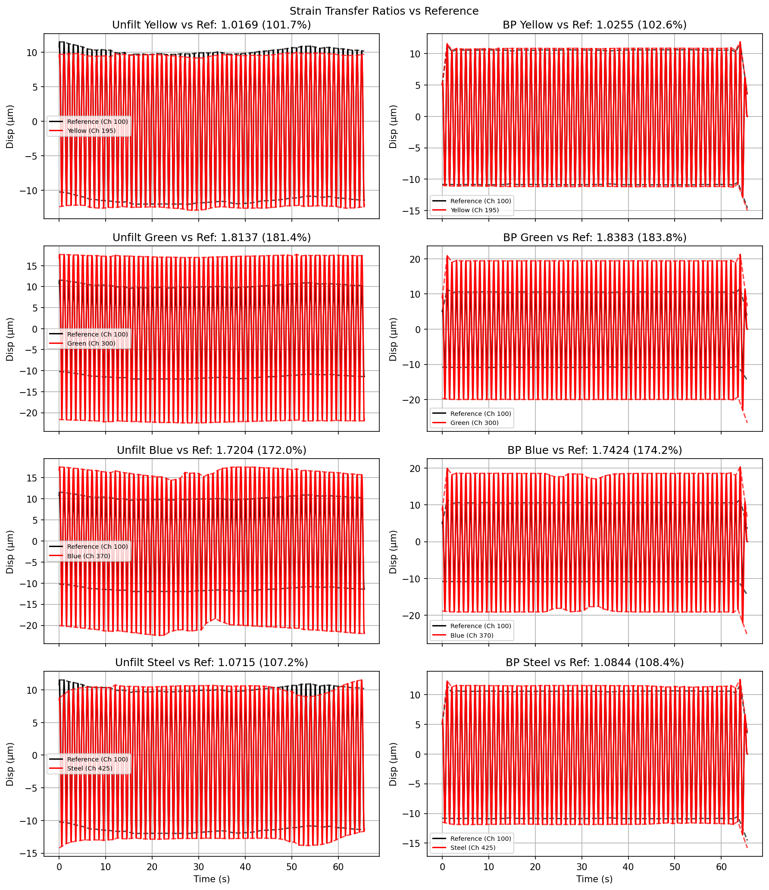
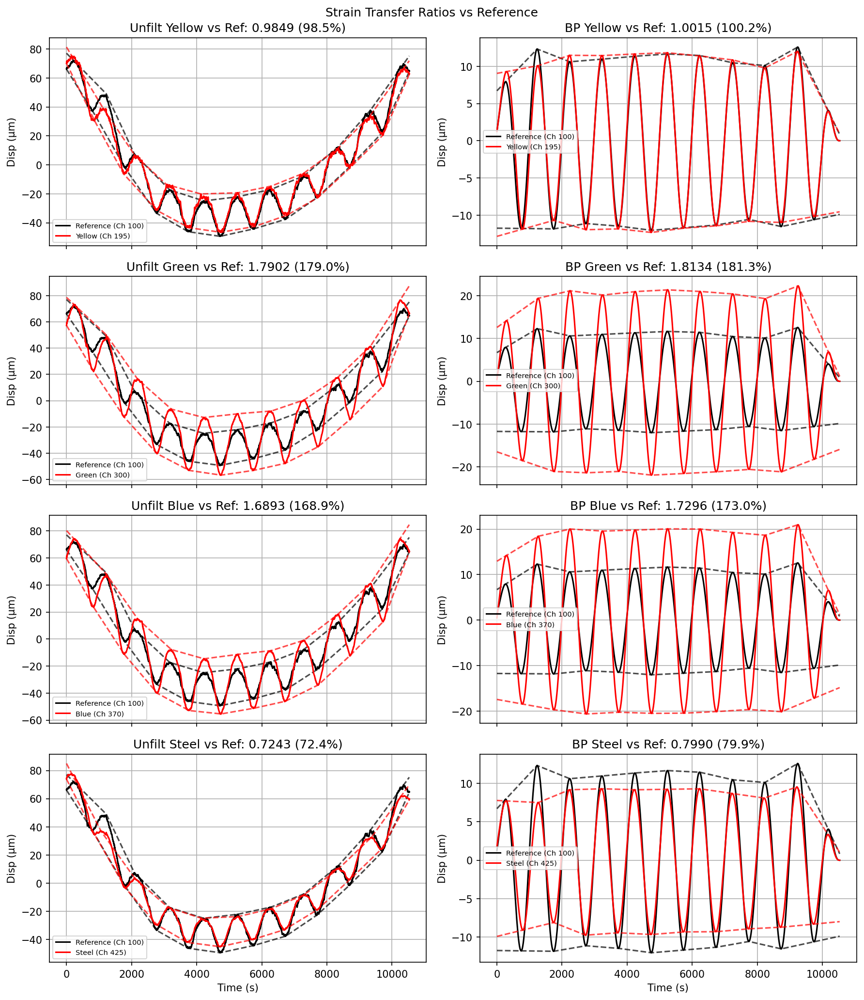
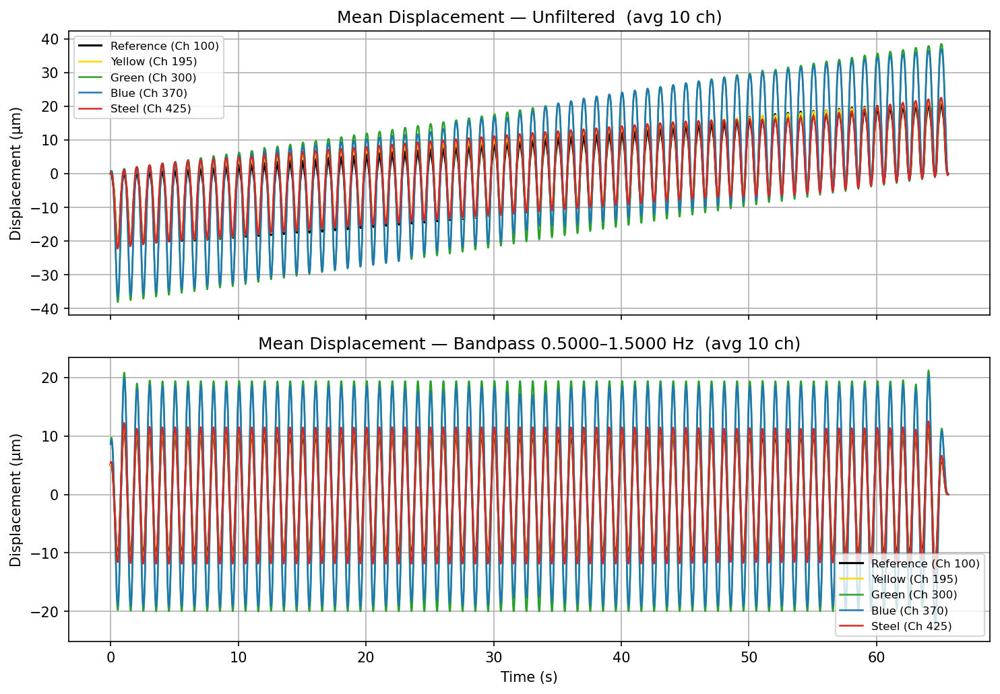

# Coupling Dependence of DAS Strain Transfer

*Thesis research on how borehole coupling controls fiber-optic strain sensitivity.*

Distributed acoustic sensing (DAS) measures strain rate along an optical fiber, but the fiber only records motion that is mechanically transferred into it. This project quantifies that transfer under controlled borehole conditions: the same 7 V displacement drive is applied at two frequencies (**1 Hz** and **0.001 Hz**), with two coupling regimes — **gravity alone** versus an **air-inflated FLUTe liner at 5 psi**. The scripts process OptaSense TDMS recordings and produce the waterfalls, spectra, displacement traces, and strain-transfer ratios shown below.

## Experiment design

| Condition | Coupling | Drive frequency | Drive amplitude | Figure set |
|-----------|----------|-----------------|-----------------|------------|
| FLUTe liner | Air-inflated liner, 5 psi | 1 Hz | 7 V | [`figures/flute_5psi_1hz_7v/`](figures/flute_5psi_1hz_7v/) |
| FLUTe liner | Air-inflated liner, 5 psi | 0.001 Hz (1 mHz) | 7 V | [`figures/flute_5psi_0.001hz_7v/`](figures/flute_5psi_0.001hz_7v/) |
| Gravity | No liner (gravity seating only) | 1 Hz | 7 V | [`figures/gravity_1hz_7v/`](figures/gravity_1hz_7v/) |
| Gravity | No liner (gravity seating only) | 0.001 Hz (1 mHz) | 7 V | [`figures/gravity_0.001hz_7v/`](figures/gravity_0.001hz_7v/) |

Along the fiber, five cable sections are tracked (10-channel averages): **Reference**, **Yellow**, **Green**, **Blue**, and **Steel**. Strain-transfer ratios compare each test section’s peak-to-peak displacement to the reference section.

## What is being sensed

DAS records **strain rate** along the fiber as a function of depth and time. Waterfall plots make that field visible: horizontal bands mark cable sections, and vertical striping shows the imposed oscillation.

**1 Hz, FLUTe 5 psi** — strong, localized response at each section over ~65 s:



**0.001 Hz, FLUTe 5 psi** — same sections, but the period is ~1000 s and the record spans hours:



## Coupling force and strain sensitivity

Holding frequency and drive voltage fixed, coupling changes how much of the reference motion appears on the test cables.

### 1 Hz — gravity vs FLUTe

Gravity alone (left conceptually: poor transfer) leaves most of the fiber nearly quiet away from the reference zone. With the 5 psi liner, every tagged section carries a clear 1 Hz signature.

**Gravity (1 Hz):**



**FLUTe 5 psi (1 Hz):**


Channel amplitude profiles make the same point spatially. Under gravity, amplitude concentrates near the reference (~25 µm) and collapses elsewhere. With the liner, each cable section forms a clear plateau, with Green/Blue exceeding the reference:

| Gravity, 1 Hz | FLUTe 5 psi, 1 Hz |
|---|---|
|  |  |

Strain-transfer ratios (bandpass) at **1 Hz, 7 V**:

| Section | Gravity | FLUTe 5 psi |
|---------|---------|-------------|
| Yellow | ~4% | ~103% |
| Green | ~6% | ~184% |
| Blue | ~3% | ~174% |
| Steel | ~1–4% | ~108% |

With the liner, transfer is order-unity (or larger, depending on section). Without it, only a few percent of the reference displacement reaches the test cables.

| Gravity envelopes, 1 Hz | FLUTe envelopes, 1 Hz |
|---|---|
|  |  |

### 0.001 Hz — same coupling contrast at ultra-low frequency

At 1 mHz the drive is slow enough that unfiltered traces include large drifts; bandpass isolates the imposed cycle. The coupling story remains: liner-coupled sections track the reference closely, while gravity-only transfer stays low for most cables (Green is the partial exception).

| Gravity envelopes, 0.001 Hz | FLUTe envelopes, 0.001 Hz |
|---|---|
|  |  |

Strain-transfer ratios (bandpass) at **0.001 Hz, 7 V**:

| Section | Gravity | FLUTe 5 psi |
|---------|---------|-------------|
| Yellow | ~16% | ~100% |
| Green | ~39% | ~181% |
| Blue | ~5% | ~173% |
| Steel | ~3% | ~80% |

## Frequency effect

The same physical drive amplitude (7 V) is applied at two frequencies that differ by three orders of magnitude.

- **1 Hz** — short records (~1 minute), dense oscillations, strain-rate amplitudes on the order of 10³–10⁴ nm/s in well-coupled sections.
- **0.001 Hz** — multi-hour records (~10⁴ s), one cycle per ~1000 s, much smaller strain-rate amplitudes because the same displacement is spread over a far longer period.

Spectra confirm energy at the drive frequency for each case (example, FLUTe 1 Hz):


Mean displacement time series for the same run:



## Analysis outputs

Each experiment folder under [`figures/`](figures/) contains the full product set from `AnalyzeStrainSaveFigs.py`:

| File | Content |
|------|---------|
| `fig1_strain_rate_waterfall.png` | Raw strain-rate field (depth × time) |
| `fig2_strain_waterfall_filtered.png` | Bandpass-filtered strain |
| `fig3_fft_spectrum.png` | Displacement spectra per section |
| `fig4_mean_displacement.png` | Section-averaged displacement (unfiltered + bandpass) |
| `fig5_envelopes.png` | Peak envelopes and strain-transfer ratios vs reference |
| `fig6_channel_amplitude_profile.png` | Amplitude vs channel along the fiber |

## Scripts

```text
raw *.tdms
      │
      ▼
ProcessTDMS.py           →  processed/*.npz
      │
      ▼
AnalyzeStrainSaveFigs.py →  figures/*.png  +  Excel summary
```

- **[`ProcessTDMS.py`](ProcessTDMS.py)** — ADC scale, convert to strain rate, decimate, concatenate TDMS files into one array (memory-mapped for large runs).
- **[`AnalyzeStrainSaveFigs.py`](AnalyzeStrainSaveFigs.py)** — load processed data, integrate to displacement, bandpass, compute peak envelopes and transfer ratios, write the figures above.

Edit the **CONFIGURATION** block in each script for paths, section channels, frequency, and bandpass. Dependencies: `numpy`, `scipy`, `matplotlib`, `nptdms`, `openpyxl`.
