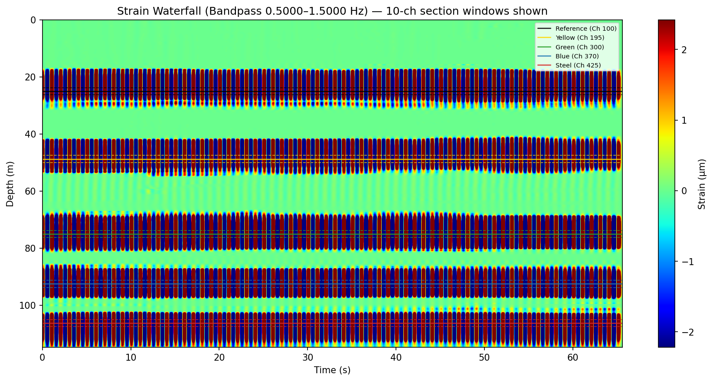
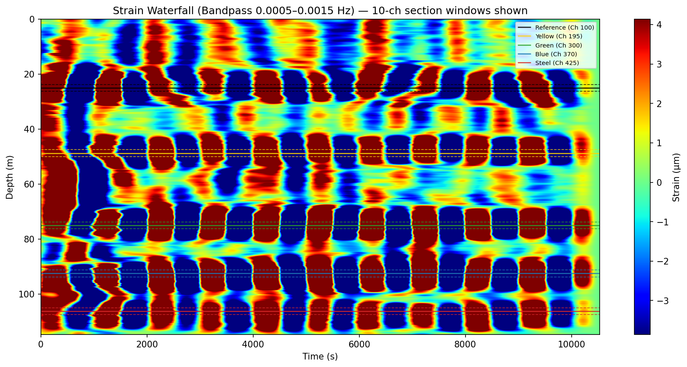
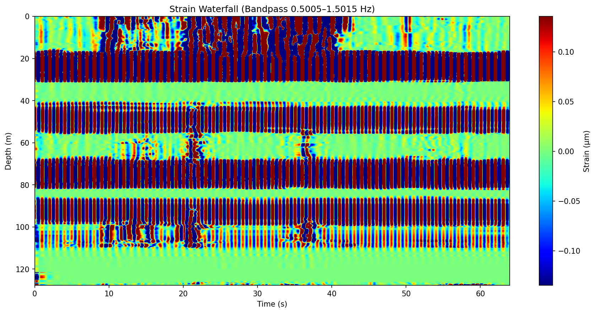
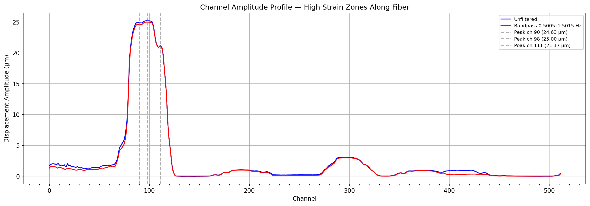
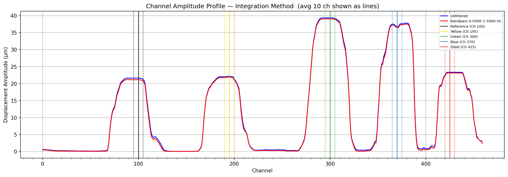
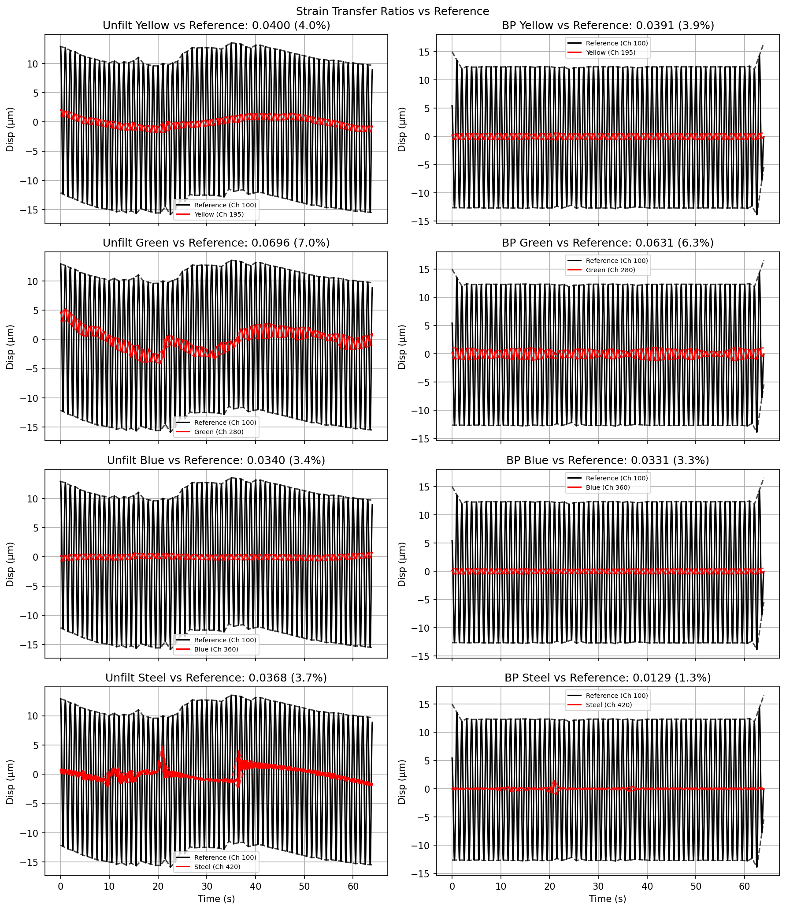
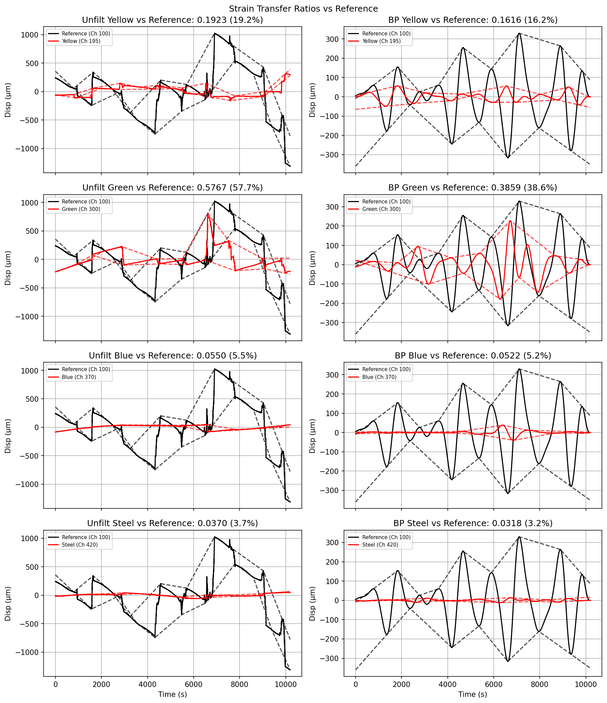
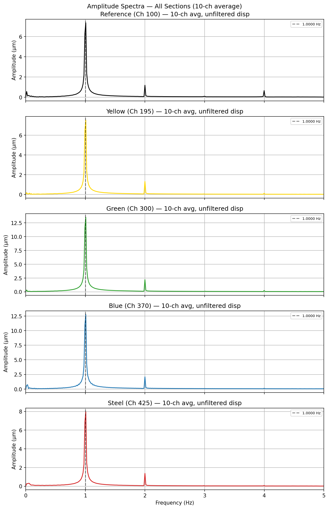

# Coupling Dependence of DAS Strain Transfer

*Thesis research on how borehole coupling controls fiber-optic strain sensitivity.*

Distributed acoustic sensing (DAS) measures strain rate along an optical fiber, but the fiber only records motion that is mechanically transferred into it. This project quantifies that transfer in a laboratory well-casing analog: a controlled axial strain is applied to PVC “casing,” while multiple fiber cables inside the pipe are interrogated simultaneously. Coupling is varied between **gravity seating alone** and an **air-inflated liner** that presses the cables against the wall. Example results below compare the same 7 V drive at **1 Hz** and **0.001 Hz**.

Setup photographs will be added here once available.

## Experimental setup

The lab fixture uses a **6.096 m** length of **0.1016 m (4 in) nominal Schedule 40 PVC** to simulate well casing. A strain assembly on the PVC comprises **six PiezoDrive ring actuators** arranged in **three pairs separated by 120°**, with pushrods and clamps that transfer force axially and limit bending. The PVC rides on rollers to reduce friction.

Clamp spacing was set to **1.72 m**, then reduced to **0.34 m** and **0.172 m** to raise the applied strain gradient by factors of **5×** and **10×**.

The actuators are driven by a **Uni-Trend UTG1022X** signal generator (sinusoid, **3.5 V** offset so the command stays non-negative), amplified **20×** by a **PiezoDrive PDu-150**. Generator amplitude spans **1–7 V** (amplifier output **20–140 V**). Drive frequencies are **0.001, 0.01, 0.1, and 1.0 Hz**, chosen to cover the band relevant to hydraulic-stimulation monitoring. Frequency, voltage, and clamp-spacing combinations are applied consistently across coupling configurations.

### Fiber cables

Four cables run through the PVC and are **fusion-spliced into one continuous fiber** so a single interrogator records them at once:

| Cable | Part number | Fiber type | Notes |
|-------|-------------|------------|-------|
| Simplex Singlemode Plenum | TLC S09SX01CZNPY12 | Singlemode | 1.2 mm jacket; also used as **reference**, Gorilla-taped to the PVC exterior |
| BRUsens Acoustic | — | — | Test cable |
| BRUsens Strain V4 | — | — | Test cable |
| AFL FIMT | — | Singlemode (×1), Multimode (×2) | 1/8" diameter, thixotropic gel fill |

In the analysis figures, section labels (**Reference**, **Yellow**, **Green**, **Blue**, **Steel**) mark 10-channel averages along that spliced fiber path.

### Coupling configurations (Experiment 1)

- **Gravity (uncoupled).** Cables rest in the PVC under their own weight.
- **Air-inflated liner.** A liner inflated to **5 psi** presses the cables against the PVC wall.
- **Tube-in-tube (additional config).** A ~2 in PVC tube inside the 4 in section, with cables inserted through a longitudinal slot, simulates fiber inside coiled tubing. Example figures below focus on gravity vs the air-inflated liner.

A second experiment (cables epoxied to the pipe) isolates cable-construction effects under near-ideal coupling and is outside the figure sets shown here.

### Acquisition

Strain rate is recorded with a **Silixa iDAS** at **1 kHz**, **10 m** gauge length, and **0.25 m** channel spacing. Each frequency / displacement / clamp-spacing combination is sampled for at least **10 periods**. Raw files are National Instruments **TDMS**.

## Example figure sets

The committed figures are from gravity vs liner-coupled runs at **7 V** generator amplitude:

| Condition | Coupling | Drive frequency | Figure set |
|-----------|----------|-----------------|------------|
| Air-inflated liner | 5 psi | 1 Hz | [`figures/liner_5psi_1hz_7v/`](figures/liner_5psi_1hz_7v/) |
| Air-inflated liner | 5 psi | 0.001 Hz (1 mHz) | [`figures/liner_5psi_0.001hz_7v/`](figures/liner_5psi_0.001hz_7v/) |
| Gravity | Gravity seating only | 1 Hz | [`figures/gravity_1hz_7v/`](figures/gravity_1hz_7v/) |
| Gravity | Gravity seating only | 0.001 Hz (1 mHz) | [`figures/gravity_0.001hz_7v/`](figures/gravity_0.001hz_7v/) |

Strain-transfer ratio = peak-to-peak displacement of a test section ÷ simultaneous reference-fiber amplitude.

## What is being sensed

DAS records **strain rate** along the fiber; integrating and bandpass-filtering yields **strain** as a function of depth and time. The waterfalls below show that strain field: horizontal bands mark cable sections, and vertical striping shows the imposed oscillation.

**1 Hz, air-inflated liner (5 psi)** — strong, localized response at each section over ~65 s:



**0.001 Hz, air-inflated liner (5 psi)** — same sections, period ~1000 s, multi-hour record:



## Coupling force and strain sensitivity

Holding frequency and drive voltage fixed, coupling changes how much of the reference motion appears on the test cables.

### 1 Hz — gravity vs air-inflated liner

Under gravity alone, most of the fiber is quiet away from the reference zone. With the liner at 5 psi, every tagged section carries a clear 1 Hz signature.

**Gravity (1 Hz):**



**Air-inflated liner, 5 psi (1 Hz):**


Channel amplitude profiles make the same point spatially. Under gravity, amplitude concentrates near the reference (~25 µm) and collapses elsewhere. With the liner, each cable section forms a clear plateau, with Green/Blue exceeding the reference:

| Gravity, 1 Hz | Liner 5 psi, 1 Hz |
|---|---|
|  |  |

Strain-transfer ratios (bandpass) at **1 Hz, 7 V**:

| Section | Gravity | Liner 5 psi |
|---------|---------|-------------|
| Yellow | ~4% | ~103% |
| Green | ~6% | ~184% |
| Blue | ~3% | ~174% |
| Steel | ~1–4% | ~108% |

With the liner, transfer is order-unity (or larger, depending on section). Without it, only a few percent of the reference displacement reaches the test cables.

| Gravity envelopes, 1 Hz | Liner envelopes, 1 Hz |
|---|---|
|  |  |

### 0.001 Hz — same coupling contrast at ultra-low frequency

At 1 mHz the drive is slow enough that unfiltered traces include large drifts; bandpass isolates the imposed cycle. Liner-coupled sections still track the reference; gravity-only transfer stays low for most cables (Green is a partial exception).

| Gravity envelopes, 0.001 Hz | Liner envelopes, 0.001 Hz |
|---|---|
|  |  |

Strain-transfer ratios (bandpass) at **0.001 Hz, 7 V**:

| Section | Gravity | Liner 5 psi |
|---------|---------|-------------|
| Yellow | ~16% | ~100% |
| Green | ~39% | ~181% |
| Blue | ~5% | ~173% |
| Steel | ~3% | ~80% |

## Frequency effect

The same generator amplitude (7 V) is applied at two frequencies that differ by three orders of magnitude.

- **1 Hz** — short records (~1 minute), dense oscillations, strain-rate amplitudes on the order of 10³–10⁴ nm/s in well-coupled sections.
- **0.001 Hz** — multi-hour records (~10⁴ s), one cycle per ~1000 s, much smaller strain-rate amplitudes because the same displacement is spread over a far longer period.

Spectra confirm energy at the drive frequency (example, liner 5 psi, 1 Hz):



Mean displacement time series for the same run:


## Analysis outputs

Each folder under [`figures/`](figures/) contains the full product set from `AnalyzeStrainSaveFigs.py`:

| File | Content |
|------|---------|
| `fig1_strain_rate_waterfall.png` | Raw strain-rate field (depth × time) |
| `fig2_strain_waterfall_filtered.png` | Bandpass-filtered strain |
| `fig3_fft_spectrum.png` | Displacement spectra per section |
| `fig4_mean_displacement.png` | Section-averaged displacement (unfiltered + bandpass) |
| `fig5_envelopes.png` | Peak envelopes and strain-transfer ratios vs reference |
| `fig6_channel_amplitude_profile.png` | Amplitude vs channel along the fiber |

## Scripts

```text
raw *.tdms  (Silixa iDAS)
      │
      ▼
ProcessTDMS.py           →  processed/*.npz
      │
      ▼
AnalyzeStrainSaveFigs.py →  figures/*.png  +  Excel summary
```

- **[`ProcessTDMS.py`](ProcessTDMS.py)** — ADC scale, convert to strain rate, decimate, concatenate TDMS files into one array (memory-mapped for large runs).
- **[`AnalyzeStrainSaveFigs.py`](AnalyzeStrainSaveFigs.py)** — load processed data, integrate to displacement, bandpass, compute peak envelopes and transfer ratios, write the figures above.

Edit the **CONFIGURATION** block in each script for paths, section channels, frequency, and bandpass. Dependencies: `numpy`, `scipy`, `matplotlib`, `nptdms`, `openpyxl`.
